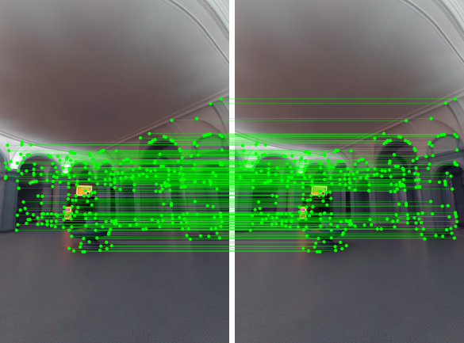
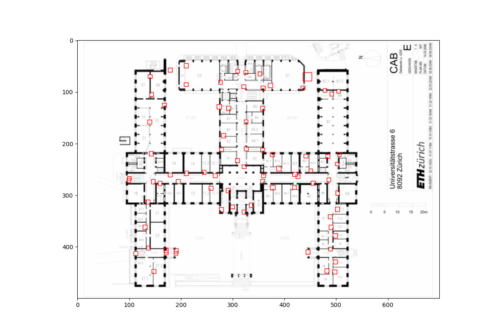
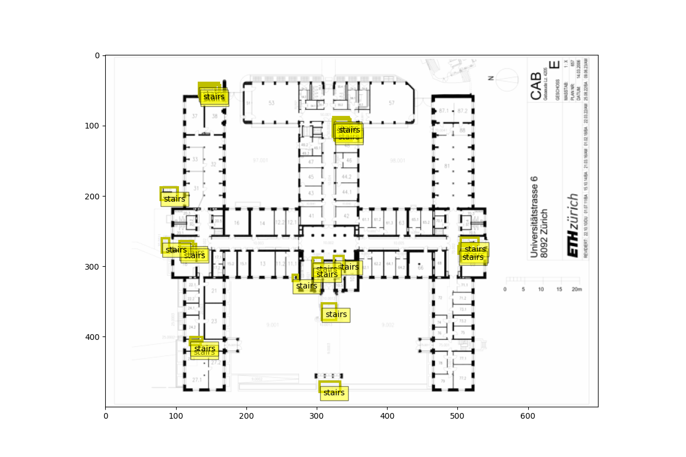

# Localizr_backend

# Inlock
core of the backend

## inlock/localization

#### localize.py
entire localization system using PyTorch, to load pre trained models, processess images, matches features, estimates poses and visualize poses.
PretrainedModel.preprocess - Preprocess image
LocalizationModule.extract_retrieval_features - Extract retrieval features
LocalizationModule.extract_local_features - Extract local features
LocalizationModule.match_features - Match features

## inlock/segmentation
### inlock/segmentation/ml
ML pipeline for segmentation

### inlock/segmentation/traditional
traditional computer vision techniques for segmentation

### inlock/segmentation/objectdetection
RCNN for detection of rooms / stairs

examples of predictions from the networks

### Door Detection

### Stairs Detection

unfortunatley we had to remove the models because of space
- training files run_object_detection.py
- inference files run_inference_doors.py and run_inference_strairs.py

## inlock/server
### navigate.py 
This script loads a building model from a JSON file and provides functions to check if a point is inside a contour, find the nearest node to a position, and navigate the shortest path between two points in the building's graph.

## inlock/building_model
### building_model.py 
defines a building model for 
- representing and manipulating building data, including nodes, edges, locations, floors, and the building's graph structure
- provides functionality to serialize and deserialize this data to and from JSON format.

## inlock/ground_truth
### graph_generation.py
extracts info from an SVG file and constructs a graph representing rooms, stairs, elevators, and connections with distances in meters.

